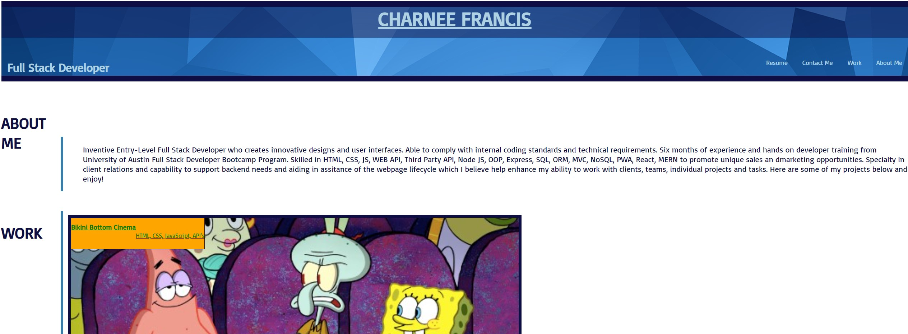
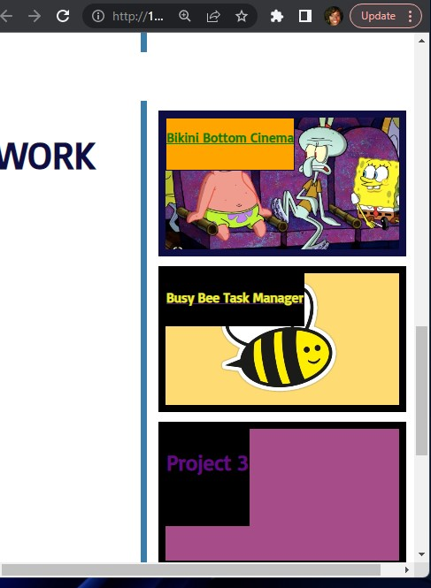

# Charnee Francis Portfolio

This is a showcase of my projects I've completed along with my resume attached.


## Deployment

To deploy this project run

```bash
  npm run deploy
```


## Features

- Fullscreen mode
- Cross platform


## Screenshots





## 🔗 Links
[](https://github.com/cffrancis)
[](https://www.linkedin.com/in/charnee-francis-80975377/)


## Authors

- [@cffranc1](https://www.github.com/cffranc1)


## License

[MIT](https://choosealicense.com/licenses/mit/)


## Acknowledgements

 - Thank you Michael Calimbas for your tutoring session!

